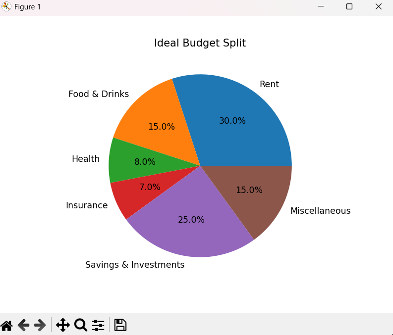
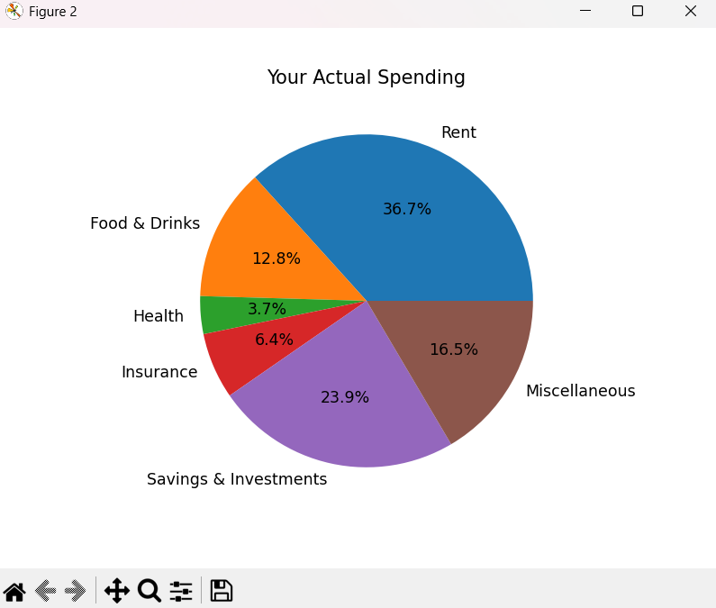

# Financial Planner
This project is a basic budget planning tool developed for my course. The main purpose is to help an individual understand how their monthly income can be divided into different spending categories, and then compare it with how they actually spend it.

Many people do not keep track of where their money goes each month, which leads to overspending (Real). This program gives a clearer picture by showing recommendations vs the user’s real spending.
# What The Program Does
The program:
1. Asks the user for their monthly income

2. Calculates suggested amounts for each category based on common budgeting guidelines

3. Asks the user how much they actually spend in each category

4. Compares the suggested and actual values

5. Gives simple feedback about overspending or underspending

6. Displays two pie charts:
Ideal Budget Split
Actual Spending
# Categories Used
The budget is divided into:
- Rent

- Food & Drinks

- Health

- Insurance

- Savings & Investments

- Miscellaneous
# Tools and Libraries
- Python
- matplotlib (pie charts)
# How To Run
1. Install Python
2. Install matplotlib (if needed)
3. Run the script:

# Example Output

Along with the pie charts for comparison:

